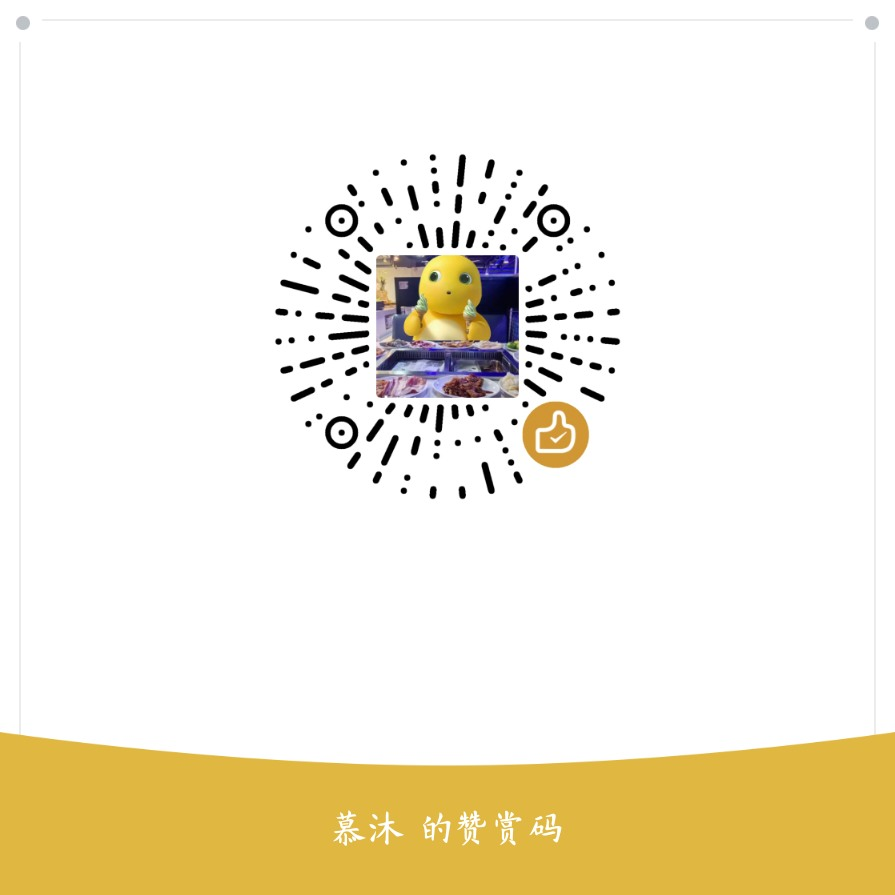

# DeepSeek Harness Desktop

English | [中文](README.md)

[](https://github.com/xiaowei2025cqu23phy/dsh-desktop/actions/workflows/build.yml)
[](https://github.com/xiaowei2025cqu23phy/dsh-desktop/releases)
[](LICENSE)

A desktop client for [DeepSeek Harness](https://github.com/deepseek-ai/deepseek-harness) (Electron + TypeScript).

## What this is

Harness is a capable agent runtime, but it lives in a browser tab: you have to remember to open it, remember to watch it, and the moment you step away from the machine you can only wait. This project moves it onto the desktop and adds the three things a browser tab can't do:

- **It watches for you** — when you go idle, it fills the screen with the agent's live work (and can even replace the Windows system screensaver); when the agent is stuck waiting for approval, it comes to find you instead of you polling a tab.
- **It makes your phone a remote** — scan a QR code, then send tasks, watch streaming progress and approve in one tap; the approval queue is shared across all three surfaces, so whoever answers first wins.
- **It turns QQ / Telegram into a remote control** — send one line in a private chat and the agent goes to work, then reports back on its own.

Everything runs locally; keys and sessions never leave your machine.

## Contents

- [Download & Install](#download--install) · [Fresh-install in 3 steps](#-fresh-install-in-3-steps-for-new-machines)
- [Features](#features) · [Demos](#demos)
- [Quick Start](#quick-start) · [Feature Details](#feature-details)
- [Development](#development) · [Harness wire protocol](#harness-wire-protocol) · [Known Limitations](#known-limitations)
- [Credits](#credits) · [Support](#support)

## License & Terms of Use

This project is licensed under a **custom license** (see [LICENSE](LICENSE)). Core terms:

- **No commercial use**: No derivative project may be used for commercial purposes (except DeepSeek AI, the author, project contributors, and individuals/organizations with the author's explicit written authorization).
- **Must stay open source**: Any derivative project must publish its source code and comply with this license.
- **Broader grants**: The author reserves the right to grant broader terms (including commercial use) to specific individuals/organizations with explicit written authorization; without it, the default terms apply.
- Third-party dependencies (DeepSeek Harness, `@tencent-connect/qqbot-nodejs`, Electron, etc.) follow their own licenses; see [THIRD_PARTY_NOTICES.md](THIRD_PARTY_NOTICES.md) and "Credits" below.

## Privacy

- Release packages (installer exe / zip) contain only application code and runtimes — **no** local configuration, wallpapers, access tokens, API keys, session data, or logs.
- User wallpapers, tokens, and configuration live under the system user directory (`%APPDATA%/DeepSeek Harness Desktop`) and never enter the packages or the repository.
- The installer **never deletes user data**: uninstallation keeps `%APPDATA%` config and wallpapers (`deleteAppDataOnUninstall = false`).
- Building from source produces the same privacy guarantees.
- Release packages ship `LICENSE` and `THIRD_PARTY_NOTICES.md` under the install directory's `resources/` folder (same place for the portable zip).

## Download & Install

Download from [GitHub Releases](https://github.com/xiaowei2025cqu23phy/dsh-desktop/releases). Three forms:

| Form | File | Notes |
|---|---|---|
| **Installer (recommended)** | `DeepSeek-Harness-Desktop-Setup-*.exe` | NSIS installer; double-click to install; creates Start Menu and desktop shortcuts; optional install directory |
| Portable | `DeepSeek.Harness.Desktop-*.win.zip` | Extract and run; no installation; great for USB drives |
| From source | Clone repo, `npm install && npm start` | Build it yourself |

Uninstalling keeps user config and wallpapers (does not delete `%APPDATA%`); for a full cleanup remove `%APPDATA%/DeepSeek Harness Desktop` manually.

> Requirements: **Windows x64**, **Node.js ≥ 22.13** (24 LTS recommended).
> The packaged build bundles the Electron runtime and uses its built-in `node:sqlite` — no external database needed. A system Node is only used for source builds/tests, and for hosting the harness via `npx`.
> Tip: Run `npx @deepseek-ai/dsh web` and configure a model API key first for the best experience.

### 🆕 Fresh-install in 3 steps (for new machines)

The installer ships without the agent runtime and without any config/keys (by design — privacy first). On a new PC:

1. **Install Node.js (LTS)** — download the Windows Installer (.msi, LTS 22/24) from https://nodejs.org/zh-cn/download and click through; or run `winget install OpenJS.NodeJS.LTS` in PowerShell. Verify with `node -v` in a new terminal. (Slow network? `npm config set registry https://registry.npmmirror.com`.)
2. **Install this desktop app** — download the installer above (or the portable zip) and run it.
3. **Add a model API key** — open the app → open the built-in Web UI (Settings → Service → Open Web UI) → Settings → Models, and enter a model API key (e.g. DeepSeek official). Keys stay on your machine.

> No manual dsh install needed: on first launch the desktop fetches the agent runtime via `npx`.
> Want the QQ bot too? Register a bot on the QQ Open Platform and paste AppID/Secret into Settings → QQ Bot (see [QQ-BOT.md](docs/QQ-BOT.md)).

> 📖 Step-by-step installation, configuration, phone and QQ-bot usage: [Hands-on Guide (bilingual)](docs/USAGE.md). Hook up DingTalk / Feishu / Home Assistant / iOS Shortcuts and more: [Integration Guide](docs/INTEGRATIONS.md). 🤖 Full QQ-bot guide (deploy/permissions/commands/FAQ): [QQ-BOT.md](docs/QQ-BOT.md). 📱 Phone PWA features: [PWA.md](docs/PWA.md).

## Features

### ✨ Highlights

- **Embedded Web UI**: native control bar + the full harness Web UI (sessions, tools, plugins). **Dual-instance support**: the built-in page and the 🧪 button in the top bar switch between the *official release* (`npx`) and a *local fork* build, each with its own port / `DSH_HOME` / credentials. The instance's origin and capabilities are **auto-probed** — users who only have the official dsh get a fully working app, and fork-only enhancements (sidebar file browser, text/image preview, …) appear only when the probe finds them, so no dead entry points on an official instance.
- **AI Screensaver (system screensaver replacement)**: after N idle minutes, a fullscreen view shows the agent working live (reasoning, text stream, tool calls); click, key, wheel, or touch exits instantly. Built-in **task timeout guard** prevents runaway CPU loops; can be registered as the Windows system screensaver — idle time becomes productive time.
- **Phone remote control (PWA)**: scan the QR code to connect over LAN — send tasks, watch live streaming progress, stop tasks; **one-tap approval/question cards** — no more waiting forever when the agent asks for permission. Add it to the home screen to use it like an app. Remote access is LAN-only and auto-disables after 2 hours by default; **never expose the harness via tunneling, port forwarding or a public reverse proxy**. Control stays on the desktop: pause every connection at once, pause/blacklist an individual device (a blacklisted device is rejected even with a valid token), auto-pause on lock/sleep, and optionally bind only the current LAN IP (default is 0.0.0.0 on all adapters, including VPN/virtual ones). Devices are approved once, then remembered.
- **PWA offline shell (optional HTTPS)**: enabling HTTPS in settings generates a self-signed certificate covering every local LAN IP. After trusting it once on the phone, the Service Worker registers — the app shell is cached and opens offline, and "Add to Home Screen" works. Over plain HTTP browsers refuse to register a Service Worker, so the PWA runs as an ordinary tab instead.
- **Persistent status bar**: three live chips in the top bar — running activities ▶, today's token usage 💰, approved remote devices 📱 — visible without sending a command or opening settings. The phone gets the same strip (running / usage).
- **First-run onboarding**: a three-step checklist on first launch (① harness ready ② model configured ③ start using), showing each step's live status and jumping straight to model setup — no need to guess the next step from the docs.
- **QQ / Telegram bot channels**: run tasks from private chat (in groups the bot chats only — every command and query is ignored); **proactive push** enabled (QQ 48h interaction window) — task done, failed, or needs approval, the bot comes to you; low-risk approvals carry inline **Allow/Deny buttons** (high-risk write/delete/exec operations are routed to the desktop for confirmation); access control is **disabling "allow being added as a friend" on the platform** (confirmed once on first enable) plus an optional **openid allowlist** (empty = unrestricted).
- **QQ bot experience (0.6.0+)**: workspace-less tasks merge into one per-user default task session (no more session spam; the same session is reused across restarts); pick a workspace with `任务 @workspace` or send tasks while inside a workspace chat; `进展` shows the phase (thinking/tool/output/done + product hint); tasks are silent by default, `播报` opts into live digests; robot chats (DM & groups) live in a visible "机器人对话" workspace; **groups are chat-only — commands and queries are ignored** (so strangers cannot read your data or drive your PC) with a safety reminder; archived sessions can be brought back anytime with `恢复 <sessionId>`; full command set & deployment/permission guide: [QQ-BOT.md](docs/QQ-BOT.md).
- **Default chat mode**: with one toggle, plain messages enter pure chat directly (no workspace bound) — no command prefix needed.
- **Model selection**: quick default-model switching (DeepSeek official, OpenAI, Anthropic, 37+ catalog providers), plus custom OpenAI-compatible gateways (corporate gateways, Ollama local, etc.); API keys are written securely via `credentials.set`.
- **Per-surface wallpapers + beads pixel filter**: separate wallpapers for main window / phone / screensaver, crop editor, position offset, mask; import your own images and pixelate them locally (no copyright issues); built-in whale wallpaper packs, one-click apply.
- **Harness hosting**: auto-detects a running `dsh web`, spawns one if missing (default `npx @deepseek-ai/dsh web`), restarts on crash, and takes over automatically when an external instance disappears.
- **AI activity center & local memory**: one place to see remote task status, source and workspace; per-workspace local project memory (summary / conventions / commands / notes) with drafts generated from README and package.json; injection is off by default and only joins a task's context for matching directories once you explicitly enable it.
- **Auditable timeline & tiered notifications**: tasks, approvals, questions and memory usage form an exportable, clearable local timeline; approval, question, success and failure notifications toggle independently with quiet hours.
- **Serial task queue**: tasks persist into a queue and line up behind a running one; failures retry automatically (exponential backoff 30s/60s, max 2 attempts); tasks interrupted by an app restart are marked failed and can be retried by hand; the workbench "task queue" panel supports cancel and retry-now.
- **Three-page workbench**: top-bar tabs **Workbench / Workspaces / Sessions** — workbench aggregates pending approvals, the activity center, workspace health, the task queue, usage and audit; the workspace page shows health, local memory and related activity per workspace; the settings drawer keeps only real configuration.
- **SQLite local storage**: activities, audit and the task queue live in local SQLite (`userData/local.db`, zero extra dependencies) with transactional writes and indexed queries; legacy JSON data migrates automatically on first launch.
- **File preview enhancements**: the phone PWA previews very large text in chunks and shows images inline (≤2MB), still bounded by the workspace allowlist.
- **System tray**: auto-start on boot, one-click screensaver, quick Web UI access, update notifications.

## Demos

**Main window with wallpaper pass-through** (the main-window wallpaper shows through the embedded chat pages):


**Phone PWA remote control** (scan to connect → pick workspace & model → run a task → watch it live):


**AI screensaver** (fullscreen live agent view when idle; wallpaper fully customizable):


> Recorded with the built-in "whale ocean" sample wallpaper — no personal wallpapers or session content involved.

## Quick Start

```sh
npm install
npm start        # build and launch the desktop app
```

On first launch it probes `http://127.0.0.1:3080`: an existing harness is adopted; otherwise it runs `npx --yes @deepseek-ai/dsh web --port 3080` automatically (requires Node.js ≥ 22.13).

> Tip: run `npx @deepseek-ai/dsh web` and configure a model API key first for the best experience.

## Feature Details

### Model switching

The "default model" dropdown in the top bar lists every configured provider and model:

- Selecting one writes through `session.selectModel`; the harness **also persists it as the default for new sessions** — hot-applied, no restart.
- **Settings → Add custom provider** registers an OpenAI-compatible gateway (presets: DeepSeek official / OpenAI / Ollama local / custom), with "fetch models from gateway" discovery. API keys are written via `credentials.set`, never stored in plaintext config.
- Fuller model management (keys, catalog providers, reasoning parameters) lives in the embedded Web UI under **Settings → Models**.

### AI screensaver

**Settings → AI Screensaver**:

| Setting | Description |
|---|---|
| Enable idle detection | Enter the fullscreen screensaver once idle passes the threshold |
| Idle minutes before trigger | Default 5 minutes |
| Auto-start an agent task | **Off by default.** Entering the screensaver shows only the ambient view (clock/status) and consumes nothing; when checked, it creates a session and runs a task |
| Task prompt | Customize the screensaver task (default: browse tech news and summarize) |
| Task working directory | Optional; the agent's working directory |
| Task timeout (minutes) | Default 10 minutes. The task stops automatically on timeout — prevents a runaway agent burning CPU (an important guardrail) |

The screensaver renders the agent's reasoning, output text and tool-call cards live (streamed as incremental appends, so long output doesn't stutter). **Exit: click, key, wheel or touch — all instant**; mouse movement does not exit (so a jittery mouse doesn't dismiss it). After exiting, the task **keeps running in the background** by default and "continue last task" resumes it next time; turn "keep task" off to start fresh each entry. Screensaver sessions are named "AI 屏保任务 HH:MM" so they're easy to spot in the Web UI.

**Anti-bounce**: both the system-screensaver launch (`/s`) and idle auto-activation are subject to a 5-minute exit cooldown — once you dismiss it, neither will bring it back for 5 minutes. The manual "AI Screensaver" button is exempt.

**Register as the Windows system screensaver**: after clicking "register as system screensaver", Windows' lock/timeout mechanism launches this app with `/s` straight into fullscreen (registry `HKCU\Control Panel\Desktop\SCRNSAVE.EXE`, no admin required; the previous setting is backed up before registering and restored on unregister).

> Note: the AI screensaver is a **viewing mode** — it shows you what the agent is doing rather than taking over your mouse and keyboard. Before leaving the agent to work while you're idle, consider whether the task really needs to run (model calls cost tokens, tool calls cost CPU).

### Harness service

- **auto (default)**: probe for a running instance (port 3080 or a custom one), host one if there is none.
- **external**: connect to an external address only (e.g. another machine on the LAN).
- **managed**: always host it from the desktop. The launch command has **one-click templates**: official latest (`npx @deepseek-ai/dsh`, auto-downloaded), official pinned version (e.g. `@deepseek-ai/dsh@0.1.1-rc.2`), or a local repo script (browse to `run-local.cmd`); you can also type a custom command (e.g. `pnpm dsh web --port {port}`).

### Appearance · wallpapers

**Settings → Appearance** customizes:

- **Main-window wallpaper**: the top bar and settings drawer show a frosted-glass pass-through (the embedded Web UI's area is unaffected).
- **Screensaver wallpaper**: fullscreen background with an adjustable mask (0.1–0.9) for legibility.
- Images are copied into the app data directory (`%APPDATA%/DeepSeek Harness Desktop/wallpapers`) so moving/deleting the original is harmless; png/jpg/jpeg/gif/webp/bmp supported.

### Phone remote control (PWA)

Enabling **Settings → Remote Access** starts a LAN gateway (default port 3082, configurable, Bearer token auth):

1. Connect the phone to the same Wi-Fi and scan the **QR code** in the settings panel (or open `http://<PC-IP>:3082`).
2. The phone's first connection enters the desktop's **pending-device queue**; approve it once and that device is remembered, no further prompts.
3. The PWA fills in the address & token automatically, shows a **persistent status strip** (running activities ▶, today's token usage 💰) fed by the same data as the desktop.

**Installing it as an app (PWA)**:

- By default it runs over plain HTTP. A phone browser treats `http://192.168.x.x` as a non-secure context and **will not register a Service Worker** — the PWA still works as an ordinary tab (messaging/tasks/approvals online), it just doesn't cache the app shell.
- For the full offline shell and "Add to Home Screen": **Settings → Remote Access → Enable HTTPS** (self-signed certificate covering every local LAN IP, cached in userData). The phone warns about the untrusted certificate on first visit — trust it once and the Service Worker registers automatically afterwards. The settings panel shows the **certificate SHA-256 fingerprint and the addresses it covers** so you can verify it before trusting. When the LAN IP changes, the certificate is re-issued automatically and needs to be trusted once more under the new fingerprint.
- See [docs/PWA.md](docs/PWA.md).

> Security: remote access auto-disables 2 hours after enabling (expiry policy adjustable in settings); LAN only — **never expose it via tunneling/port-forwarding**.
> Control stays on the desktop: pausing every connection **drops established connections immediately** rather than waiting for the next request; single-device pause/blacklist (a blacklisted device is rejected even with a valid token); auto-pause on lock/sleep; optional binding to the current LAN IP only.

Phone features:
- **Workspace-first new conversations** (same flow as harness Web): pick or create a workspace first, then start a conversation; new sessions land in the chosen workspace group (preset roots work as workspaces too)
- **Sessions**: list / history / live streaming / stop; send modes: queue, or steer (interrupt & insert)
- **Permission presets** per new session: workspace-write or danger-full-access (harness `/permission`; needs a recent harness)
- **Tasks**: description + workspace + model, run & watch live
- **Workspaces**: list / create / folder browsing; **file preview**: text/Markdown/images/video (mp4/webm)/audio/PDF — when the browser blocks inline PDF, use open-in-new-tab / download
- **Wallpaper**: built-in packs, or **upload a picture from the phone gallery** as wallpaper
- **Settings**: preset workspace roots (view/remove/browse-to-add), scheduled tasks, restart Harness
- **Auto-reconnect**: exponential backoff after network drops; returns to the same conversation
- **Security**: Bearer token + device approval + RPC allowlist + file-browse allowlist (workspaces/preset roots only, 403 otherwise), LAN only

The bottom of the sidebar has **🗄 Archived**: archived sessions can be restored with one tap (they return to their original workspace group; refreshed automatically when the desktop hosts the service, and after a restart when hosted externally).

## QQ Bot Remote Control (optional)

First, on the [QQ Open Platform](https://q.qq.com) **disable the bot's "allow being added as a friend"** — only you can then add it as a friend or pull it into a group. This is the only access control available to individual (non-enterprise) accounts. Then, in **Settings → QQ Bot**, fill in the AppID/AppSecret (empty = disabled); enabling it for the first time asks you to confirm that platform-side step. An **allowed-user openid allowlist** is optional (empty = unrestricted — openid identification requires an enterprise account, so individual accounts cannot obtain their own openid; send the bot a message and the rejected openid shows up in the status panel). You can also set a **default workspace/directory** (used when a task command does not specify one). Private-chat the bot; sending anything unrecognized replies with the full command set and examples:

| Command | Description | Example |
|---|---|---|
| `状态` / `会话` / `工作区` / `模型` | Status / sessions / workspaces / models | `状态` |
| `任务 <description>` | Run a task in the default workspace | `任务 分析这个仓库的架构` |
| `任务 @<workspace> <description>` | Run in a specific workspace | `任务 @qqbot 修复登录 bug` |
| `任务 目录:<path> <description>` | Run in a specific directory (workspaces/preset roots only) | `任务 目录:D:/work 写一个脚本` |
| `进入` | **Pure chat**: no workspace bound, friend mode | `进入` |
| `进入 <workspace/dir>` | Chat inside that workspace (assistant mode) | `进入 qqbot`、`进入 D:/work` |
| *(chat mode)* | Just send messages, no prefix needed; the agent's reply is **pushed back automatically**, no "sent" noise; `退出` ends it | `帮我看看项目里的 TODO` → 💬 reply → `退出` |
| `进展 <sessionId>` | Live task progress (status / tool stats / latest output) | `进展 session-xxxxxxxx` |
| `停止 <sessionId>` / `打开 <sessionId>` | Stop a task / view session content | `停止 session-xxxxxxxx` |
| `允许` / `拒绝` | **Approval replies**: allow/reject a pending permission request (add a session id when several are pending) | `允许`、`拒绝 session-xxxxxxxx` |
| `选 <number>` | **Question replies**: answer an agent question (multi-select `选 1 3`, custom `选 自定义:…`, batch `#2 选 1`) | `选 2` |
| `定时 <duration> <task>` | **Scheduled tasks**: once (`10分钟`/`5m`/`2小时`/`1天`) or daily (`每天9:00`) | `定时 10分钟 检查更新` |
| `定时列表` / `取消定时 <index>` | List / cancel scheduled tasks | `取消定时 2` |
| `目录 <path>` / `文件 <path>` | Browse workspace dirs / view text files (allowlisted) | `目录 D:/work`、`文件 D:/work/README.md` |
| `导出 <sessionId>` | Export a session to Markdown (saved under the desktop `exports/` dir) | `导出 session-xxxxxxxx` |
| `用量` | Today's usage stats (sessions/turns/tokens) | `用量` |
| `角色 <setting>` | **Role-play**: set a character for chat mode (pure chat only); `角色 无` clears it | `角色 你是温柔的英语老师` |
| *(send an image in DM)* | **Image understanding**: in chat mode, send an image and the agent analyzes it | send a screenshot → `看看这张图有什么问题` |

**Buttons**: after a task starts, inline buttons appear — ⏹ Stop / 📋 Progress / 📖 Open; approvals carry ✅ Allow / ❌ Deny; single-choice questions carry option buttons — tap to act/answer, almost no typing needed.

**Mode prompts**: `任务 xxx` commands run the agent as a **professional assistant**; chat mode speaks like a **friend**. Both prompts are customizable in the desktop app (**Settings → QQ Bot**); leave blank to disable injection. **Role-play**: `角色 <setting>` adds a character to chat mode (e.g. "你是温柔的英语老师"), `角色 无` clears it; a default character can also be preset in the desktop app.

**Image understanding**: in chat mode, just send an image in a DM and the agent analyzes it — no extra configuration needed.

**Chat visibility**: QQ/Telegram chat sessions are pinned at the top of the phone PWA sidebar under "🤖 机器人对话" — open it to see the full conversation and follow it live (streaming).

Typical flow: `工作区` to list → `进入 qqbot` → chat freely → `退出`.

Built on [@tencent-connect/qqbot-nodejs](https://github.com/tencent-connect/qqbot-nodejs) (WebSocket gateway); protocol references: [QQ Open Platform API v2](https://bot.q.qq.com/wiki/develop/api-v2/) and the [Agent QQBot guide](https://bot.q.qq.com/wiki/agent-qqbot/). QQ official bots are mainly **passive-reply**, but within 48h of a user interaction they support **proactive push**; long replies are split automatically. When the agent needs **approval or an answer, a notification is pushed immediately** (QQ within the interaction window, and Telegram), and if the push fails, pending items are still appended to the next reply as a reminder. The phone PWA shows approval/question cards inline so you can allow/deny or answer in one tap. Both channels can enable **default chat mode**, so non-command messages go straight into pure chat without `进入` first.

## Development

```sh
npm run build    # tsc compiles main/preload/renderer/remote into dist/, then esbuild bundles the PWA and copies static assets
npm start        # build + electron .

npm test         # offline test suite (no harness needed): command parsing, RPC protocol, approval flow, task queue, SQLite, gateway disconnect
npm run lint     # ESLint (flat config, type-aware rules)
npm run smoke    # smoke test: RPC client + model catalog (needs a running harness)

npm run pack          # package installer + portable zip into release/
npm run pack:zip      # portable zip only
npm run pack:portable # single-file portable exe only
```

Type checking is split across three configs (main / renderer / PWA); `tsconfig.scripts.json` additionally runs a `checkJs` pass over `scripts/*.mjs`. CI runs on push and PR: three type checks + the scripts checkJs pass + build + ESLint + `npm test`.

> The scripts checkJs pass only fails on errors under `scripts/`: those `.mjs` files `require` the compiled `dist/` output, and `dist/` is tsc's lossy emit (type assertions are erased), so `checkJs` findings there say nothing about the source — which the three configs above already cover in full. CI filters that noise out explicitly.

Debug switches:

- `--remote-debugging-port=9222` enables CDP; inspect pages with `node scripts/cdp-eval.mjs '<expr>'`.
- `--ss-debug` keeps the screensaver window open (disables idle-exit) for debugging.
- `node scripts/mux-test.mjs <baseUrl>` end-to-end pipeline test (consumes a few model calls).

### Structure

```
src/main/          main process
  index.ts         entry (single-instance lock, /s screensaver arg, event hub, startup orchestration)
  config.ts        config read/write and legacy-config migration (userData/config.json)
  ipc.ts           IPC handler registration
  harness.ts       harness process hosting (probe/takeover/spawn/health/restart)
  client.ts        HTTP RPC client (POST /api/<method> + mux event stream)
  rpc-protocol.ts  RPC protocol adapter (typert slash vs legacy dot: capability table + arg envelopes)
  gateway.ts       LAN gateway (Bearer token, device approval, RPC & file allowlists, SSE)
  tls-cert.ts      self-signed X.509 generation (pure node:crypto, for the PWA offline shell)
  remote-commands.ts  remote command processor (shared by QQ/TG/PWA: tasks, approvals, questions, sessions, schedules)
  remote-util.ts   pure helpers for the above (unit-testable)
  qq-bot.ts        QQ adapter (gate, button identity, push, diagnostics)
  qq-commands.ts   QQ command parser (pure functions, unit-testable)
  qq-onboard.ts    QQ scan-to-bind flow
  telegram-bot.ts  Telegram adapter
  models.ts        model catalog, default-model switching, custom provider wizard
  screensaver.ts   AI screensaver (idle detection, fullscreen window, task orchestration, system registration)
  appearance.ts    per-surface wallpapers and the beads pixel filter
  workspace-registry.ts  workspace registry and path allowlist
  db.ts            SQLite local storage (activity/audit/task queue, legacy JSON migration)
  event-hub.ts     mux event broadcast
  notifications.ts tiered notifications and quiet hours
  updater.ts       version check
  diagnostics.ts   diagnostics collection
  settings-heal.ts harness settings self-heal (backs up before rewriting)
  tray.ts / windows.ts  system tray and window management
src/preload.ts     preload (IPC bridge; the renderer never touches Electron directly)
src/renderer/      renderer (classic scripts, no bundler)
  index.html       main window (control bar + workbench + webview)
  main.ts          main-window logic
  screensaver.html fullscreen screensaver (live agent view)
src/remote/        phone PWA (served by the gateway)
  index.html app.ts  single-page app
  sw.js              offline shell (registers only over HTTPS)
  manifest.webmanifest + icons
scripts/           build, smoke, e2e and offline test scripts
```

### Harness wire protocol

The desktop app implements deepseek-harness's HTTP RPC protocol directly and speaks **two harness generations**:

- **Official `@deepseek-ai/dsh` 0.1.2-rc.1+** (typert slash protocol): protocol and per-method argument envelopes are negotiated at probe time; browser token auth (`?token=` exchanged for a persistent cookie); model catalog via `session/modelCatalog`; providers via `llm/listProviders` / `llm/listConfigurableProviders`; custom providers written through `settings/update` + `settings/mutate` + `credentials/set`.
- **Legacy / self-built forks** (dot protocol): automatic fallback for `llm.models`, `llm.providers`, `workspace.*`, `host.describe`, and friends.
- Unary calls: `POST /api/<method>` with `{type:'client-request', rpcId, method, payload}`; responses are `{type:'server-response', rpcId, result}`; loopback needs no token.
- Event stream: `GET /api/events.mux` (SSE / WebSocket auto-negotiated); `session/event` frames drive the screensaver, phone PWA and bot channels.
- Session history replay (the official build has no `session.history`): read `projections.asOfSeq` from `session/list`, then pull records via `session/page` and replay message-level events to the phone, QQ and screensaver clients.
- Key methods: `session.list/create/prompt/cancel/rename/selectModel`, `session.modelCatalog`, `session.page`, `llm.listProviders/listConfigurableProviders/discoverModels`, `settings.update/mutate`, `credentials.set`, `workspace.create/rename/delete`.

Protocol details may evolve with the harness; argument envelopes (typert: `_request` / `request` / flat) are adapted per method, and where the official build drops a legacy method the desktop degrades or bridges it (e.g. `workspace.list` synthesized from session cwd).

## Known Limitations

- Mobile browsers generally refuse to preview PDFs inside an iframe; the phone offers "open in new tab / download" instead.
- The screensaver is a **viewing mode**: interactions (input, approvals) happen back in the main Web UI; a session that needs confirmation waits and stays visible in the Web UI.
- System screensaver registration is Windows-only (registry-based; original settings are backed up before registering and restored on unregister); macOS/Linux use the built-in idle-detection mode instead.
- The event stream negotiates automatically: older harness versions only accept WebSocket (HTTP 426), newer ones also support SSE; both are compatible.
- The screensaver window follows system screensaver behavior (no auto-wake from sleep).
- The PWA offline shell needs HTTPS plus a one-time certificate trust; changing network or adapter changes the LAN IP and requires trusting the new certificate.

## Credits

| Project | Contribution | License |
|---|---|---|
| [deepseek-ai/deepseek-harness](https://github.com/deepseek-ai/deepseek-harness) | Core agent runtime and Web UI; this desktop app implements its HTTP RPC protocol directly | MIT |
| [tencent-connect/qqbot-nodejs](https://github.com/tencent-connect/qqbot-nodejs) | QQ Open Platform bot SDK (WebSocket gateway, messages) for the QQ channel | MIT |
| [tencent-connect](https://github.com/tencent-connect) org repos (bot-docs, botpy, …) | QQ Open Platform API and interaction docs | Their own licenses |
| [node-qrcode](https://github.com/soldair/node-qrcode) | QR code generation for phone pairing | MIT |
| [Electron](https://github.com/electron/electron) | Desktop application framework | MIT |
| [electron-builder](https://github.com/electron-userland/electron-builder) | Application packaging | MIT |

Thanks to the DeepSeek Harness community and everyone who provided feedback during testing. See [THIRD_PARTY_NOTICES.md](THIRD_PARTY_NOTICES.md) for the full third-party component and license list (including transitive dependencies); a copy ships inside every release package.

### Acknowledgements

This project stands on the shoulders of many excellent open-source projects. Special thanks to:

| Project | Contribution |
|---|---|
| [deepseek-ai/deepseek-harness](https://github.com/deepseek-ai/deepseek-harness) | The core agent engine and the HTTP RPC / event-stream protocol that the desktop app, phone PWA and bot channels are all built on |
| [tencent-connect/qqbot-nodejs](https://github.com/tencent-connect/qqbot-nodejs) | QQ Open Platform bot Node SDK: WebSocket gateway, messaging, proactive push (48h window) and inline-keyboard approval buttons |
| [tencent-connect/qqbot-agent-sdk](https://github.com/tencent-connect/qqbot-agent-sdk) | Reference implementation of scan-to-configure onboarding (`create_bind_task` / AES-GCM credential decryption) and approval inline keyboards |
| [tencent-connect/dsh-qqbot](https://github.com/tencent-connect/dsh-qqbot) | The official QQ×DSH plugin: design reference for command sets, session mapping and event presentation |
| [Electron](https://github.com/electron/electron) & [electron-builder](https://github.com/electron-userland/electron-builder) | Desktop shell and packaging |
| [node-qrcode](https://github.com/soldair/node-qrcode) | QR generation for phone pairing and QQ scan login |

QQ bot protocol details follow the [QQ Open Platform API v2](https://bot.q.qq.com/wiki/develop/api-v2/) and the [Agent QQBot guide](https://bot.q.qq.com/wiki/agent-qqbot/).

If you maintain any of these projects — thank you for making this possible 🙏

## Support

Found it useful? Join the beta group for feedback and feature requests, or buy the author a coffee ☕

| Beta group (QQ) | WeChat reward |
|---|---|
|  |  |

Inside the group you can try the [QQ bot](docs/USAGE.md) directly — remote control, approvals and proactive reports. If this project is useful to you, a ⭐ on GitHub helps others find it.
