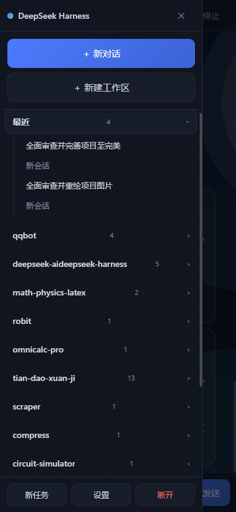
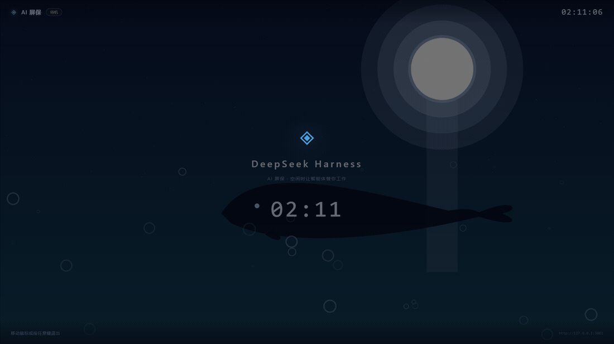
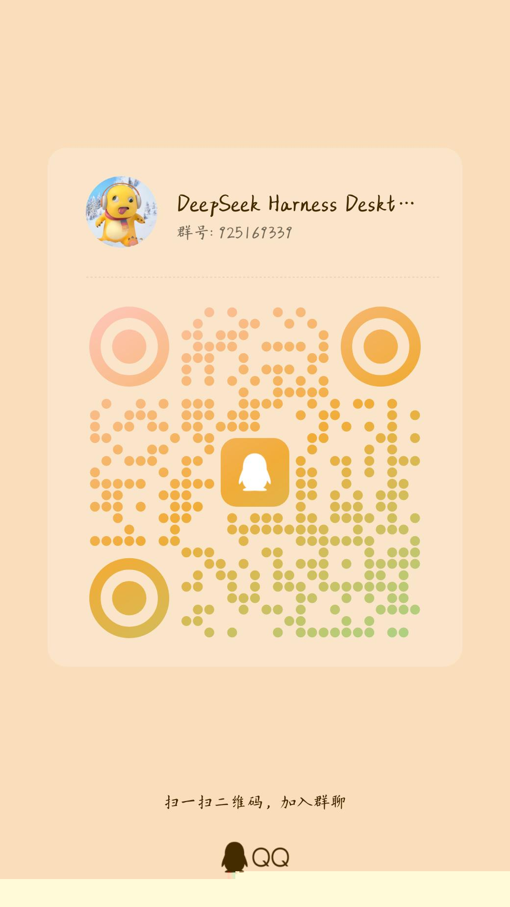

# DeepSeek Harness Desktop

中文 | [English](README.en.md)

[DeepSeek Harness](https://github.com/deepseek-ai/deepseek-harness) 的桌面客户端(Electron + TypeScript)。

## 许可证与使用条款

本项目遵循**自定义许可协议**(见 [LICENSE](LICENSE)),核心条款:

- **不得商用**:任何衍生项目不得用于商业用途(DeepSeek 官方、本项目作者本人、有关项目贡献者及作者书面授权的个人/组织除外)。
- **必须开源**:任何衍生项目必须公开源代码,并同样遵守本协议。
- **更宽松授权**:作者保留对特定个人或组织授予更宽松协议条款的权利(包括商业使用许可),须经作者明确书面授权;未获书面授权者一律适用本协议默认条款。
- 第三方依赖组件(DeepSeek Harness、`@tencent-connect/qqbot-nodejs`、Electron 等)遵循各自许可证,详见下文「参考与致谢」。

## 隐私说明

- 发布包(安装包 exe / zip)只包含应用代码与运行库,**不包含**任何本地配置、壁纸、访问令牌、API 密钥、会话数据或日志。
- 用户的壁纸、令牌与配置保存在系统用户目录(`%APPDATA%/DeepSeek Harness Desktop`),永远不会进入安装包或提交到仓库。
- 安装程序**不会删除**用户数据:卸载时保留 `%APPDATA%` 下的配置与壁纸(`deleteAppDataOnUninstall = false`)。
- 若从源码自行构建,构建产物同样不涉及上述用户数据。

## 下载与安装

从 [GitHub Releases](https://github.com/xiaowei2025cqu23phy/dsh-desktop/releases) 下载,三种形态任选:
| 形态 | 文件 | 说明 |
|---|---|---|
| **安装版(推荐)** | `DeepSeek-Harness-Desktop-Setup-*.exe` | NSIS 安装程序,双击安装,自动创建开始菜单与桌面快捷方式,可选安装目录 |
| 便携版 | `DeepSeek.Harness.Desktop-*.win.zip` | 解压即用,免安装,适合 U 盘携带 |
| 源码版 | 克隆仓库 `npm install && npm start` | 自行构建 |

安装版卸载时保留用户配置与壁纸(不会删除 `%APPDATA%` 数据);如需彻底清理请手动删除 `%APPDATA%/DeepSeek Harness Desktop`。

> 系统要求:Windows x64、Node.js 18+(仅在桌面端需要托管拉起 harness 时使用)。
> 提示:先运行 `npx @deepseek-ai/dsh web` 并配置好模型密钥,再打开桌面端,体验最佳。

> 📖 完整安装、配置、手机端与 QQ 机器人使用步骤见 [实操指南(汉英双语)](docs/USAGE.md),接入钉钉/飞书/Home Assistant/iOS 捷径等更多方式见 [接入指南](docs/INTEGRATIONS.md)。

## 参考与致谢

本项目在设计与实现中参考、依赖并致谢以下开源项目的贡献:

| 项目 | 贡献 | 许可 |
|---|---|---|
| [deepseek-ai/deepseek-harness](https://github.com/deepseek-ai/deepseek-harness) | 核心智能体运行时与 Web UI;桌面端直接实现其 HTTP RPC 协议(`dsh-host-apiproxy`:一元 RPC、mux 事件流、settings/credentials/llm 域) | MIT |
| [tencent-connect/qqbot-nodejs](https://github.com/tencent-connect/qqbot-nodejs) | QQ 开放平台机器人 SDK:WebSocket 网关、消息事件、文本/媒体/流式消息发送,用于 QQ 远程控制通道 | MIT |
| [tencent-connect](https://github.com/tencent-connect) 组织相关仓库(bot-docs、botpy 等) | QQ 开放平台 API 与交互文档,QQ 适配器实现的协议参考 | 各自许可 |
| [node-qrcode](https://github.com/soldair/node-qrcode) | 二维码生成,用于手机扫码配对 | MIT |
| [Electron](https://github.com/electron/electron) | 桌面应用框架 | MIT |
| [electron-builder](https://github.com/electron-userland/electron-builder) | 应用打包 | MIT |

同时感谢 DeepSeek Harness 社区与本项目测试过程中提供反馈的各位使用者。

## ✨ 功能亮点

- **内嵌 Web UI**:原生控制条 + 内嵌完整 harness Web UI(会话、工具、插件全功能)。
- **AI 屏保(替换系统屏保)**:空闲 N 分钟自动全屏显示 agent 实时工作画面(思考过程、文本流、工具调用),鼠标移动即退出;内置**任务超时守卫**,杜绝失控循环烧 CPU;可注册为 Windows 系统屏保,空闲时间即生产力时间。
- **手机 PWA 遥控**:扫码配对(自动填地址+令牌),手机上发任务、看流式进展、停止任务;**审批/提问卡片一键应答**——agent 卡住等你批准时不再"失联"。远程访问仅面向可信局域网,默认启用 2 小时自动关闭;**禁止使用内网穿透、端口转发或公网反向代理暴露 Harness**。
- **QQ / Telegram 机器人通道**:群聊/私聊发指令即干活;打通**主动推送**(QQ 交互后 48h 窗口),任务完成、失败、要审批都会主动找你;QQ 审批带「允许/拒绝」内联按钮,点一下即批;还支持**扫码登录**自动获取机器人凭据。
- **默认对话模式**:机器人开启后,普通消息直接进入纯对话(不绑定工作区),无需任何指令前缀。
- **各种模型选择**:快捷切换默认模型(DeepSeek 官方、OpenAI、Anthropic 及 37+ 目录 Provider),添加自定义 OpenAI 兼容网关(公司网关、Ollama 本地等),密钥安全写入 credentials 存储。
- **三端独立壁纸 + 拼豆像素滤镜**:主窗口 / 手机 / 屏保各配一张,导入自己的图片一键拼豆化(本地处理,不碰版权);内置鲸鱼系列壁纸包一键应用。
- **harness 托管**:自动探测已运行的 `dsh web`,没有则自动拉起(默认 `npx @deepseek-ai/dsh web`),崩溃自动重启。
- **AI 活动中心与本地记忆**:统一查看远程任务状态、来源和工作区;按工作区保存本地项目记忆(简介/约定/常用命令/笔记),可从 README 与 package.json 一键生成草稿,默认关闭注入,仅在用户明确启用后加入匹配目录的任务上下文。
- **可信审计与通知分级**:任务、审批、提问和记忆使用形成可导出、可清空的本地时间线;审批、问题、成功和失败通知可独立开关并支持勿扰时段。
- **串行任务调度队列**:任务持久化入队,已有任务运行中时新任务自动排队;失败自动重试(指数退避 30s/60s/120s,最多 2 次),应用重启后中断任务标记失败可手动重试;工作台「任务队列」面板支持取消与立即重试。
- **工作台三页导航**:顶栏「工作台 / 工作区 / 会话」——工作台聚合待处理审批、活动中心、工作区健康、任务队列、用量与审计;工作区页按工作区查看健康状态、编辑本地记忆与关联活动;设置抽屉只保留真正配置项。
- **SQLite 本地存储**:活动、审计与任务队列存入本地 SQLite(userData/local.db,零额外依赖),事务写入与索引查询,旧 JSON 数据首次启动自动迁移。
- **文件预览增强**:手机 PWA 预览支持超大文本分片加载与图片直接查看(≤2MB),仍受工作区白名单限制。
- **系统托盘常驻**:开机自启、一键启动屏保、快速打开 Web UI、更新提示。

## 演示

**主窗口与壁纸穿透**(主窗口壁纸会透出到内嵌对话页):


**手机 PWA 远程控制**(扫码连接 → 选择工作区与模型 → 一键运行任务 → 实时流式查看):



**AI 屏保**(空闲全屏展示 agent 实时工作画面,壁纸可自定义):



> 演示使用内置"鲸鱼海洋"示例壁纸录制,不涉及任何个人壁纸或会话内容。

## 快速开始

```sh
npm install
npm start        # 构建并启动桌面端
```

首次启动会自动探测 `http://127.0.0.1:3080`:已有 harness 则直接接入;没有则自动执行 `npx --yes @deepseek-ai/dsh web --port 3080` 拉起(需要 Node.js 18+)。

> 提示:先运行 `npx @deepseek-ai/dsh web` 并配置好模型密钥,再打开桌面端,体验最佳。

## 功能说明

### 模型切换

顶栏的「默认模型」下拉框列出当前已配置的全部 Provider 与模型:

- 选择后通过 `session.selectModel` 写入,harness 会**同时持久化为新会话的默认模型**,热生效、无需重启。
- 「设置 → 添加自定义 Provider」可添加 OpenAI 兼容网关(预设:DeepSeek 官方 / OpenAI / Ollama 本地 / 自定义),支持「从网关拉取模型」自动发现模型列表;API Key 通过 `credentials.set` 安全写入,不会明文落盘到配置。
- 更完整的模型管理(密钥配置、目录 Provider、推理参数)在嵌入式 Web UI 的「设置 → Models」页面。

### AI 屏保

「设置 → AI 屏保」:

| 配置 | 说明 |
|---|---|
| 启用空闲检测 | 空闲达到阈值后自动进入全屏屏保 |
| 空闲几分钟后触发 | 默认 5 分钟 |
| 自动启动 agent 任务 | **默认关闭**。进入屏保只显示环境画面(时钟/状态),不消耗任何资源;勾选后才会自动创建会话执行任务 |
| 任务提示词 | 自定义屏保任务(默认:浏览科技新闻并整理要点) |
| 任务工作目录 | 可选,指定 agent 的工作目录 |
| 任务超时(分钟) | 默认 10 分钟。任务超时未完成自动停止——防止 agent 失控循环烧 CPU(这是重要护栏) |

屏保画面实时渲染 agent 的思考、输出文本与工具调用卡片(流式渲染为增量追加,不因长输出卡顿)。**退出方式:点击、按键、滚轮、触摸均可立即退出**;鼠标移动不触发退出(避免鼠标抖动导致屏保闪退)。退出后任务默认**保留在后台继续运行**,下次进入屏保会「继续上次任务」;关闭「保留任务」则在每次进入时重启新任务。任务会话自动命名「AI 屏保任务 HH:MM」,便于在 Web UI 中识别。

**防循环弹出**:系统屏保拉起(`/s`)与空闲检测自动激活都受 5 分钟退出冷却约束——用户点击退出后,5 分钟内不会被系统/空闲检测再次拉起,避免"关了又弹"。用户主动点击「AI 屏保」按钮不受此限制。

**注册为 Windows 系统屏保**:点击「注册为系统屏保」后,Windows 的锁屏/超时机制会用 `/s` 参数拉起本应用直接进入全屏模式(注册表 `HKCU\Control Panel\Desktop\SCRNSAVE.EXE`,无需管理员权限;注册前自动备份原设置,取消时恢复)。

> 体验提示:AI 屏保是「观看模式」——它全屏展示 agent 正在做什么,而不是接管你的鼠标键盘。空闲时让 agent 干活前,先想清楚任务是否真的需要跑(模型调用消耗 token、工具调用消耗 CPU)。

### Harness 服务

- **auto(默认)**:先探测已运行实例(接入 3080 或自定义端口),没有则托管启动。
- **external**:仅连接外部地址(如局域网内的另一台机器)。
- **managed**:始终由桌面端托管启动,可自定义启动命令(如指向本地仓库的 `pnpm dsh web --port {port}`)。

### 外观 · 壁纸

「设置 → 外观」可分别自定义:

- **主窗口壁纸**:顶栏与设置抽屉呈现毛玻璃透出效果(不影响内嵌 Web UI 的显示区域)。
- **屏保壁纸**:全屏背景图,带可调遮罩(0.1~0.9)保证文字可读。
- 图片会复制到应用数据目录(`%APPDATA%/DeepSeek Harness Desktop/wallpapers`),原图移动/删除不影响;支持 png/jpg/jpeg/gif/webp/bmp。

### 手机远程控制(PWA)

「设置 → 远程访问」启用后,桌面端开一个局域网网关(默认端口 3082,Bearer token 认证):

1. 手机与电脑连同一 WiFi,用手机扫设置面板中的**二维码**(或浏览器访问 `http://<电脑IP>:3082`)
2. PWA 自动填入地址与令牌并连接,可**添加到主屏幕**当作 App 使用

手机端功能:

- **会话**:列表、历史、实时流式收发消息、停止任务
- **任务**:输入描述 + 选择工作区 + 选择模型,一键运行并实时查看
- **工作区**:列表、新建、按工作区执行任务;**📂 浏览文件夹**、点文件**预览文本内容**(≤64KB)
- **设置**:手机端同样可管理多项设置——预设工作区根目录(查看/移除/浏览添加)、手机壁纸、定时任务、重启 Harness 等
- **安全**:Bearer token 认证 + RPC 白名单 + 文件浏览白名单(仅工作区/预设根内,越权 403),仅局域网可达

### QQ 机器人远程控制(可选)

「设置 → QQ 机器人」填入在 [QQ 开放平台](https://q.qq.com) 注册机器人得到的 AppID/AppSecret 即启用(留空自动禁用),也可设置**默认工作区/目录**(任务命令未指定时自动使用)。在 QQ 私聊机器人发送指令(发送任意无法识别的消息,机器人会自动回复完整指令集与示例):

| 指令 | 说明 | 示例 |
|---|---|---|
| `状态` / `会话` / `工作区` / `模型` | 查询类 | `状态`、`工作区` |
| `任务 <描述>` | 默认工作区执行任务 | `任务 分析这个仓库的架构` |
| `任务 @<工作区名> <描述>` | 指定工作区执行 | `任务 @qqbot 修复登录 bug` |
| `任务 目录:<路径> <描述>` | 指定目录执行 | `任务 目录:D:/work 写一个脚本` |
| `进入` | **纯对话**:不绑定工作区/目录,朋友模式 | `进入` |
| `进入 <工作区名/目录>` | 在该工作区对话(助手模式) | `进入 qqbot`、`进入 D:/work` |
| *(对话模式)* | 直接发消息即可,无需前缀;agent 回复**自动推送**给你,全程无"已发送"噪音;`退出` 结束 | `帮我看看项目里的 TODO` → 💬 回复 → `退出` |
| `进展 <会话id>` | 任务实时进展(状态/工具统计/最新输出) | `进展 session-xxxxxxxx` |
| `停止 <会话id>` / `打开 <会话id>` | 停止任务 / 查看会话内容 | `停止 session-xxxxxxxx` |
| `允许` / `拒绝` | **审批应答**:agent 请求权限时允许/拒绝(多个待审批时带会话 id) | `允许`、`拒绝 session-xxxxxxxx` |
| `选 <编号>` | **选择题应答**:回答 agent 提问(多选 `选 1 3`,自定义 `选 自定义:…`,多题批次 `#2 选 1`) | `选 2` |
| `定时 <时长> <任务>` | **定时任务**:`定时 10分钟 检查更新`(10 分钟/5m/2小时/1天 一次性;`定时 每天9:00 写日报` 每天) | `定时 10分钟 检查更新` |
| `定时列表` / `取消定时 <编号>` | 查看/取消已排定时任务 | `取消定时 2` |
| `目录 <路径>` / `文件 <路径>` | 浏览工作区目录 / 查看文本文件(白名单内) | `目录 D:/work`、`文件 D:/work/README.md` |
| `导出 <会话id>` | 将会话导出为 Markdown(保存在桌面端 `exports/` 目录) | `导出 session-xxxxxxxx` |
| `用量` | 今日用量统计(会话数/回合数/Token) | `用量` |
| `角色 <设定>` | **角色扮演**:设置对话模式角色(仅纯对话生效,与朋友提示词叠加);`角色 无` 清除 | `角色 你是温柔的英语老师` |
| *(私聊发图片)* | **图片理解**:对话模式下直接发图片,agent 看图分析 | 发一张截图 → `看看这张图有什么问题` |

**按钮操作**:任务启动后自动附带「⏹ 停止 / 📋 进展 / 📖 打开」按钮;审批推送带「✅ 允许 / ❌ 拒绝」;单选提问带选项按钮——点一下即操作/应答,基本不用打字。

**模式提示词**:`任务 xxx` 等指令下,agent 以**专业助手**身份工作;对话模式下以**朋友**口吻聊天;两套提示词可在桌面端「设置 → QQ 机器人」自定义(留空 = 不注入)。**角色扮演**:`角色 <设定>` 为对话模式叠加角色(如"你是温柔的英语老师"),`角色 无` 清除,在桌面端同样可预设默认角色。

**图片理解**:对话模式下直接给机器人发图片(私聊),agent 自动"看图说话",无需任何额外配置。

**对话可见性**:QQ/Telegram 的对话会话在手机 PWA 侧边栏「🤖 机器人对话」分组**置顶显示**,点开即可看到完整聊天记录并实时流式同步。

典型流程:`工作区` 查看列表 → `进入 qqbot` → 连续对话 → `退出`。

基于 [@tencent-connect/qqbot-nodejs](https://github.com/tencent-connect/qqbot-nodejs)(WebSocket 长连接),协议参考 [QQ 开放平台 API v2 文档](https://bot.q.qq.com/wiki/develop/api-v2/)(消息收发/消息类型/事件订阅)与 [Agent QQBot 接入指南](https://bot.q.qq.com/wiki/agent-qqbot/)。QQ 官方机器人以**被动回复**为主,但与机器人交互后 48 小时内支持**主动推送**;长回复自动分段。**agent 需要审批/提问时会主动推送通知**(QQ 交互窗口内与 Telegram 均可即时送达;QQ 审批通知带「允许/拒绝」内联按钮,点一下即可应答),推送失败时待办仍会附加在下次消息的回复末尾提醒。手机端同样支持审批:会话中出现审批/提问卡片,一键允许/拒绝或作答。QQ/Telegram 均可开启**默认对话模式**:非指令消息直接进入纯对话(不绑定工作区),无需先发「进入」。

## 开发

```sh
npm run build    # tsc 编译 main/preload/renderer 到 dist/
npm start        # 构建 + electron .
npm run smoke    # 冒烟测试:验证 RPC 客户端与模型目录(需 harness 运行中)
npm run pack     # 打包 Windows portable 单文件 exe(electron-builder)
```

调试开关:

- `--remote-debugging-port=9222` 启动时启用 CDP,可用 `node scripts/cdp-eval.mjs '<表达式>'` 检查页面状态。
- `--ss-debug` 启动时,屏保窗口保持打开(禁用空闲退出),便于调试屏保画面。
- `node scripts/mux-test.mjs <baseUrl>` 端到端管线测试:设置默认模型 → 建会话 → 发提示 → 订阅事件流(会消耗少量模型调用)。

### 结构

```
src/main/          主进程
  index.ts         入口(单实例锁、/s 屏保参数、mux 事件桥)
  harness.ts       harness 进程托管(探测/拉起/健康检查/崩溃重启)
  client.ts        HTTP RPC 客户端(POST /api/<method> + SSE events.mux)
  models.ts        模型目录、默认模型切换、自定义 Provider 向导
  screensaver.ts   AI 屏保(空闲检测、全屏窗口、任务编排、系统屏保注册)
  tray.ts          系统托盘
src/renderer/      渲染进程(经典脚本,无打包器)
  index.html       主窗口(控制条 + webview)
  screensaver.html 全屏屏保(实时 agent 画面)
scripts/           冒烟与端到端测试脚本
```

### 与 harness 的通信协议

桌面端直接实现 deepseek-harness 的 HTTP RPC 协议(`dsh-host-apiproxy`):

- 一元调用:`POST /api/<method>`,body 为 `{type:'client-request', rpcId, method, payload}`,响应 `{type:'server-response', rpcId, result}`;回环地址免令牌。
- 事件流:`GET /api/events.mux`(SSE),推送 `session/event` 等帧,屏保页面据此实时渲染。
- 关键方法:`session.list/create/prompt/cancel/selectModel`、`host.describe`、`llm.providers/models/discoverModels`、`settings.update/mutate`、`credentials.set`。

协议细节随 harness 演进可能变化;桌面端使用的方法均来自当前 `0.1.0-rc.x` 的 `packages/host/apiproxy`。

## 已知限制

- 屏保实时画面为「观看视图」:交互(输入、审批)请回到主窗口的 Web UI 完成;agent 遇到需要确认的问题会等待,会话在 Web UI 中可见。
- 系统屏保注册仅支持 Windows(注册表方案,注册前自动备份原设置,取消时恢复);macOS/Linux 可用内置空闲检测模式。
- 事件流传输自动协商:旧版 harness 只接受 WebSocket(HTTP 返回 426),新版额外支持 SSE;两者都兼容。
- 屏保窗口内禁用了系统休眠时的自动唤醒逻辑(跟随系统屏保行为)。

## 致谢 / Acknowledgements

本项目站在众多优秀开源项目的肩膀上,衷心感谢以下项目及其维护者:

| 项目 | 贡献 |
|---|---|
| [deepseek-ai/deepseek-harness](https://github.com/deepseek-ai/deepseek-harness) | 核心 Agent 引擎与 HTTP RPC / 事件流协议,桌面端、手机 PWA 与机器人通道都建立在它之上 |
| [tencent-connect/qqbot-nodejs](https://github.com/tencent-connect/qqbot-nodejs) | QQ 开放平台机器人 Node SDK:WebSocket 网关、消息收发、主动推送(48h 窗口)与内联键盘审批按钮 |
| [tencent-connect/qqbot-agent-sdk](https://github.com/tencent-connect/qqbot-agent-sdk) | 扫码登录(onboard:create_bind_task / AES-GCM 凭据解密)与审批内联键盘的协议参考实现 |
| [tencent-connect/dsh-qqbot](https://github.com/tencent-connect/dsh-qqbot) | 官方 QQ×DSH 插件:指令集、会话映射与事件展示的设计参考 |
| [electron](https://github.com/electron/electron) 与 [electron-builder](https://github.com/electron-userland/electron-builder) | 桌面壳与打包分发 |
| [node-qrcode](https://github.com/soldair/node-qrcode) | 手机扫码配对与 QQ 扫码登录的二维码生成 |

QQ 机器人通道的协议细节参考了 [QQ 开放平台 API v2 文档](https://bot.q.qq.com/wiki/develop/api-v2/) 与 [Agent QQBot 接入指南](https://bot.q.qq.com/wiki/agent-qqbot/)。

如果你也是这些项目的维护者——谢谢你们的工作,让这个项目成为可能 🙏

## 支持与联系 / Support

觉得有用?欢迎加入内测交流群反馈问题、提出建议;也可以请作者喝杯咖啡 ☕

| 内测交流群(QQ) | 微信赞赏 |
|---|---|
|  |  |
| 群链接:https://qm.qq.com/q/okezsdj6nu | 赞赏随心,感谢支持 |

群内可直连 [@QQ 机器人](docs/USAGE.md#7-qq-机器人远程控制--qq-bot-remote-control) 试玩远程控制、审批与主动汇报能力。
